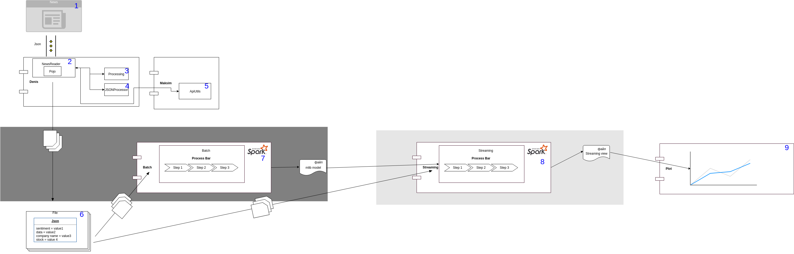
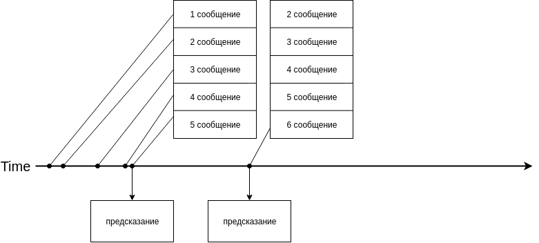

# bachelor-diploma
ELTECH bachelor diploma



1. Сайт с которого берутся новости
2. [NewsReader](NewsAndSentiment/src/main/java/ru/eltech/dapeshkov/news/NewsReader.java) читает новости с сайта ```1.``` каждые 3 минуты, парсит новость (JSON) в POJO ```4.```  применяет к новостям сентимент анализ ```3.```, получает данные о ценах используя ```5.``` создает по этим данным POJO объект, который записывается в файл ```6.```
3. [Proccessing](NewsAndSentiment/src/main/java/ru/eltech/dapeshkov/classifier/Processing.java) класс для сентимент анализа
4. [JSONProcessor](NewsAndSentiment/src/main/java/ru/eltech/dapeshkov/news/JSONProcessor.java) парсит новость в POJO, также парсит training set для обучения сентимент классификатора в POJO
5. [ApiUtils](StockAPI/src/main/java/ru/eltech/mapeshkov/stock/ApiUtils.java) класс для получения данных о ценах
6. каждая новость хранится в отдельном файле .csv, если через 3 минуты после прихода новости новая новость еще не пришла, то в файл записывается neutral сентимент, т.к. считается, что отсутсвие новостей тоже учитывается
Структура файла: имя компании, сентимент, дата, цена
``google,neutral,2019-05-01 08:31:55.0,1188.05``
7. [Batch](Batch/src/main/java/ru/eltech/mapeshkov/batch/Batch.java) читает **все** файлы ```6.``` и обучает mlib модель, когда пришли новые 50 файлов процесс повторятся, модель записывается в файл.
8. [Streaming](Streaming/src/main/java/ru/eltech/dapeshkov/streaming/Streaming.java) читает **новые** файлы каждую секунду ```6.```, модель на ```Batch``` разработана тками образом, что ей на вход подается *n* новостей (*n* - размер окна), таким образом ```Streaming``` ждет пока не придут *n* новостей и затем начинает их обработку, после того как пришли 5 новостей остальные новости обрабатываются сдвгом на 1 новость:

Предсказания записываются в файл
9. [Plot](Plot/src/main/java/ru/eltech/mapeshkov/plot/Main.java) рисует графики реальных цен и предсказанных, читая предсказания из файла, при обновлении файла, график добавляет новую точку
